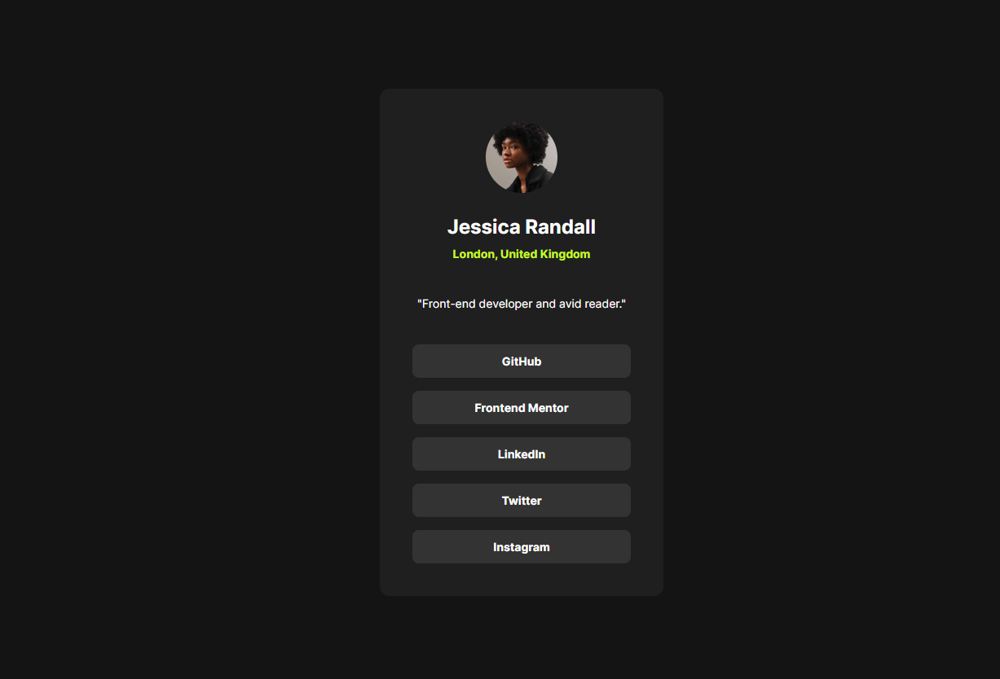

# Frontend Mentor - Social Links Profile

## Overview

A solution to the [Social Links Profile](https://www.frontendmentor.io/challenges/social-links-profile-UG12-mHmz) challenge on Frontend Mentor. Built with plain HTML and CSS — no frameworks.

**Live Site:** https://hshs-dev.github.io/social-links-profile/

## Screenshot

    

## Built with

- Semantic HTML5
- CSS custom properties
- Flexbox
- Mobile-first workflow

## What I learned

- **`clamp(min, preferred, max)` isn't a breakpoint switch** — the preferred value is what actually drives the result, and it needs to be fluid (`%`, `vw`) for clamp to do anything useful. A fixed min/max with no fluid middle value just behaves like a fixed width.
- **`width: 100%` + `max-width`** lets an element shrink with its parent instead of enforcing a hard floor that can overflow small viewports — the "mobile" gutter comes from padding on the parent, not a minimum width on the child.
- **`all: unset` strips the native focus ring too**, so any element reset with it needs an explicit `:focus-visible` state added back in, or keyboard users lose all visual feedback.
- **`line-height` needs a unitless value** (e.g. `1.5`) relative to the element's own font size — a fixed `rem` value smaller than the font size crushes the line box and causes overlapping text.

## Author

- GitHub - [@HsHs-dev](https://github.com/HsHs-dev)
